# Dokumentasi Antarmuka Pengguna (UI)

Berikut adalah tampilan antarmuka pengguna dari aplikasi yang telah dibuat:

---

### 🧑‍🏫 Dashboard Asisten
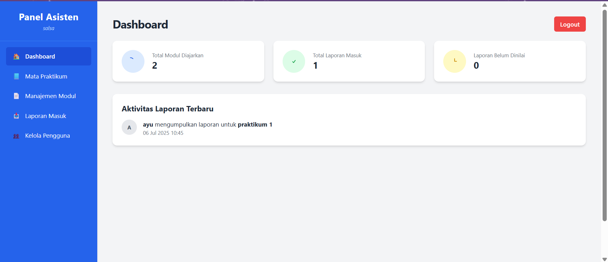

---

### 🎓 Dashboard Mahasiswa
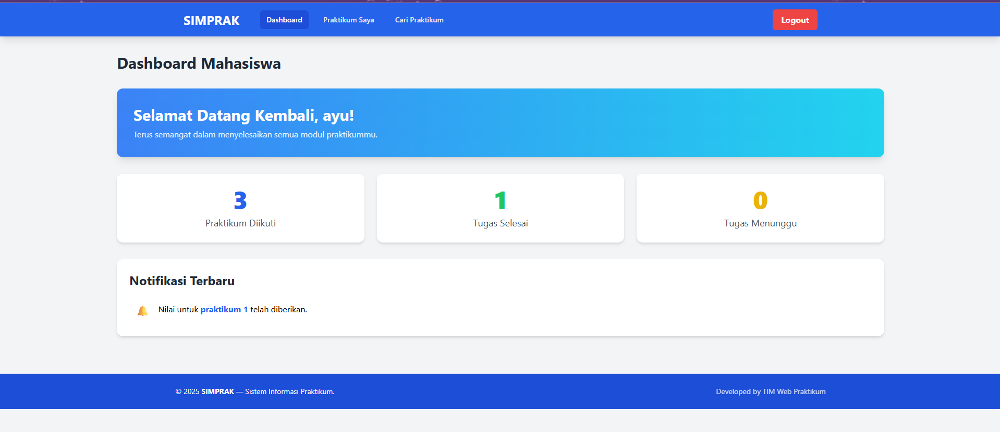

---

### 📄 Detail Praktikum Mahasiswa
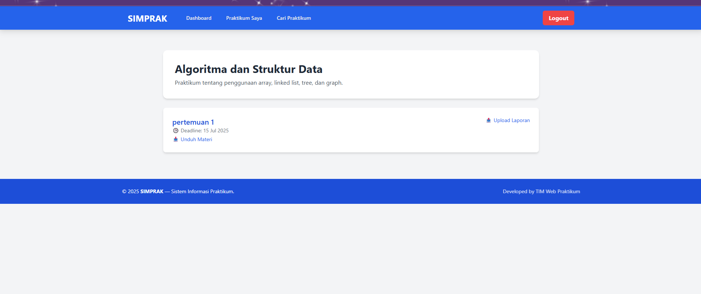

---

### 👥 Kelola Pengguna (Asisten)
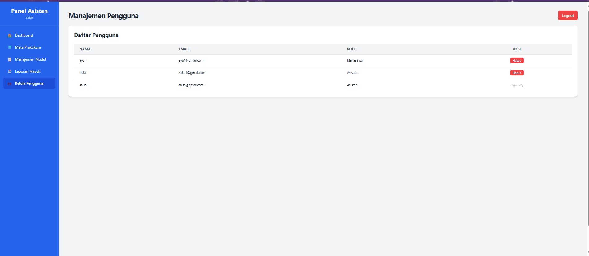

---

### 📩 Laporan Masuk (Asisten)
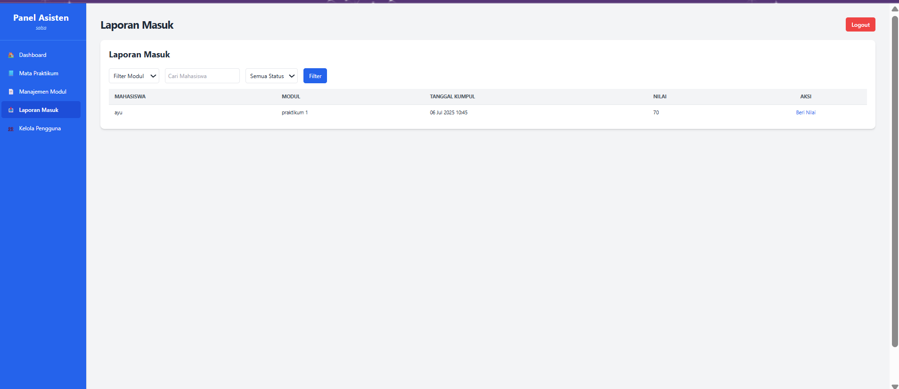

---

### 🔐 Login
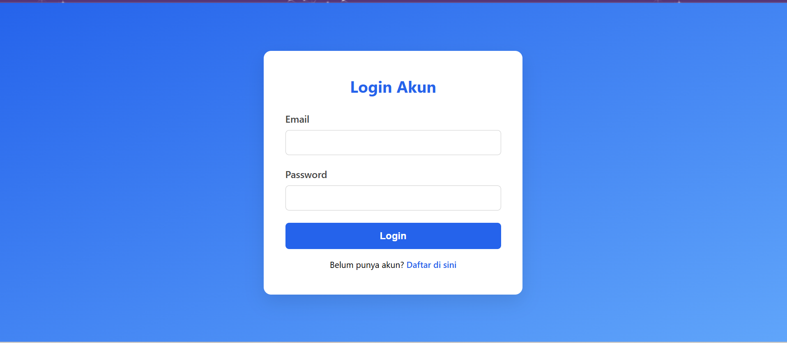

---

### 📘 Mata Praktikum (Asisten)
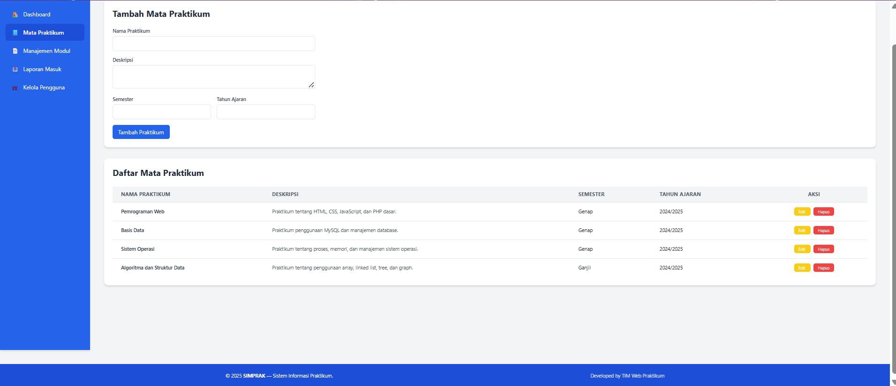

---

### 📚 Manajemen Modul (Asisten)
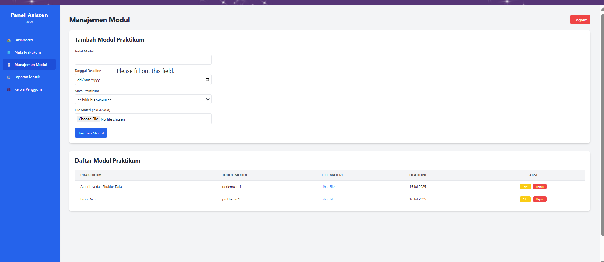

---

### 🧪 Praktikum Mahasiswa
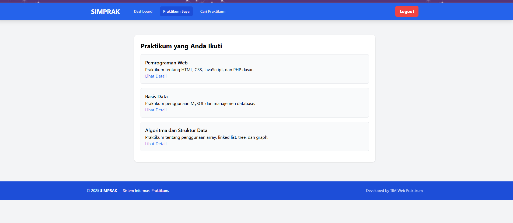

---

### 📝 Registrasi
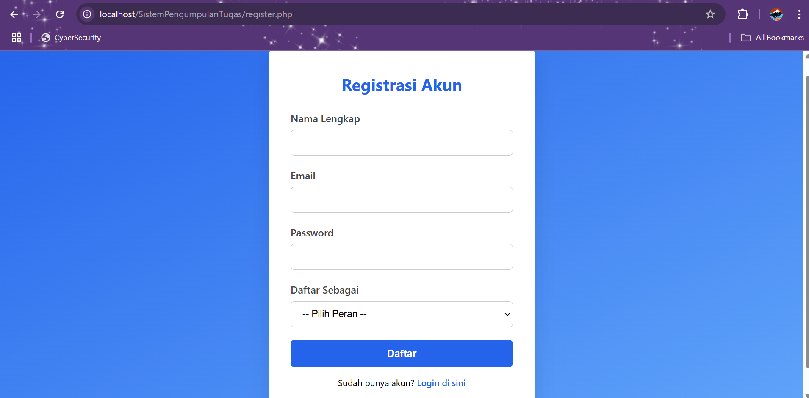

---

### 🗂️ Daftar Mata Kuliah Mahasiswa
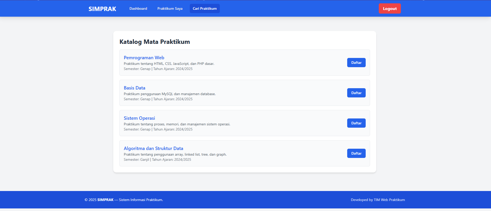
